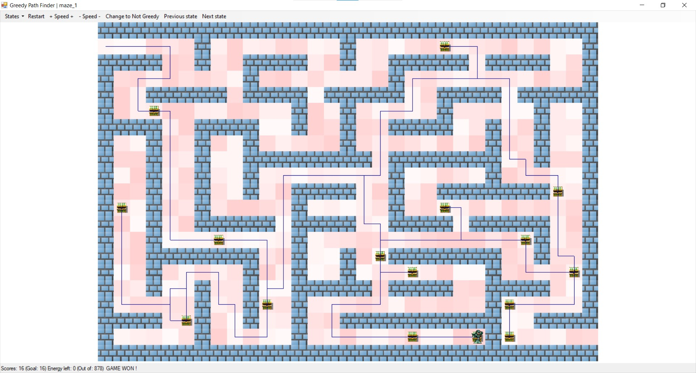

# Практики «Путь в лабиринте», «Жадина в лабиринте» и «Оптимальный маршрут»
Репозиторий содержит решения [этой](https://ulearn.me/course/basicprogramming2/Praktika_Put_v_labirinte__735a5cf7-1bb3-424c-9bed-cc38ef8675ff), [этой](https://ulearn.me/course/basicprogramming2/Praktika_Zhadina_v_labirinte__37381b02-bf90-49f2-b80d-5f30da2704a0) и [этой](https://ulearn.me/course/basicprogramming2/Praktika_Optimal_nyy_marshrut__d2eb9ae0-53f2-4ae7-95f1-20e5c712c6f9) задачи с ulearn.me.
Задачи прошли код-ревью у преподавателя (баллы: 100/100, 50/50, 50/50). Все решения курса на максимальный балл также выложены в других репозиториях.
Ветка unsolved содержит изначальный проект.

Конечное приложение - прототип пошаговой 2D игры, в которой герою нужно собирать сокровища, имея ограниченное количество энергии, проходя через клетки с установленным уровнем трудности. Как и серии предыдущих примеров, демонстрируется реализация алгоритмов.

## Практика «Путь в лабиринте»

На этот раз в [лабиринт с сокровищами](https://github.com/mnickw/Dungeons) попал Жадина! Лабиринт очень старый и все свободные клетки успели покрыться зарослями. Для каждой клетки лабиринта известна её трудность — количество сил, которые потратит Жадина на прохождение зарослей этой клетки.

После каждого шага силы Жадины уменьшаются на трудность клетки, в которую он шагнул. Когда силы заканчиваются, Жадина останавливается.

Посмотреть на лабиринты можно запустив проект:

-   Выбрать лабиринт можно в меню States слева сверху.
-   Цифры и яркость на клетках — это трудность.

Жадина хочет узнать, какое минимальное количество сил ему нужно потратить чтобы дойти от текущей клетки до какого-то из сундуков. Причём, он ещё не решил, какой из сундуков он хочет посетить, так что Жадина хочет узнать кратчайшее расстояние до каждого из сундуков.

Помогите Жадине найти кратчайшие пути до каждого из сундуков!

Для того, чтобы сдать задачу, в файле  `DijkstraPathFinder.cs`  реализуйте метод  `GetPathsByDijkstra`. Ему на вход поступают: лабиринт, начальная позиция Жадины, список целей — клеток, до которых нужно найти кратчайшие пути. Он должен возвращать пути до всех целей в виде IEnumerable в порядке увеличения трудности пути до них. При этом вычислять пути он должен лениво, то есть не вычислять пути до далёких сундуков и не обрабатывать весь лабиринт, пока это не запросили из IEnumerable.

Описание лабиринта передаётся в метод в объекте типа  `State`:

-   в поле  `CellCost`  находится двумерный массив трудностей всех клеток (0 означает стену).
-   есть методы, которые помогут проверить, что какая-то клетка является стеной или находится внутри лабиринта.
-   там же есть свойство  `Chests`, но в данной задаче вместо него используйте список целей, переданный в метод аргументом.

Все тесты в классе  `DijkstraPathFinder_Should`  должны завершиться успехом.

## Практика «Жадина в лабиринте»

Чтобы жизнь удалась, Жадине нужно собрать N сундуков. При этом, Жадина отказывается идти к сундуку, если есть другой сундук, путь до которого потребует меньше сил: он не только жадина, но и лентяй!

Помогите Жадине собрать N сундуков!

После выполнения этой задачи, Жадина начнёт передвигаться по лабиринту после запуска приложения.

Для того, чтобы сдать задачу, в файле  `GreedyPathFinder.cs`  реализуйте метод  `FindPathToCompleteGoal`. Он должен возвращать путь передвижения Жадины. Путь не должен содержать исходную позицию — ту из которой Жадина начинает движение. Если подходящего пути не существует, метод должен возвращать пустой список.

Текущее состояние уровня передается в метод в объекте типа  `State`.

Используйте класс  `DijkstraPathFinder`, реализованный в предыдущей задаче. Его не нужно включать в отправляемый на проверку файл, считайте, что этот класс уже есть в проекте. При проверке этой задачи будет использоваться авторская реализация  `DijkstraPathFinder`, а не ваша.

Гарантируется, что если рассмотреть множество всех сундуков и добавить в него исходную позицию, то в нём не существует тройки A, B, C, такой, что от А добраться до B так же трудно, как и от A до C. Другими словами, у Жадины всегда есть только один вариант дальнейших действий.

Тесты в классах  `GreedyPathFinder_Should`  и  `GreedyTimeLimit_Tests`  должны завершаться успехом.
## Практика «Оптимальный маршрут»
Однажды после очередного путешествия по лабиринту Жадина вдруг осознал, что его жадная стратегия не всегда позволяет собрать наибольшее возможное количество сундуков.

От этого счастье куда-то улетучилось!

Помогите Жадине собрать максимум сундуков при заданном ограничении сил. Без перебора порядка посещения сундуков тут не обойтись. На больших лабиринтах перебор, конечно, не справится, но на маленьких может сработать лучше, чем жадная стратегия.

Реализуйте метод  `FindPathToCompleteGoal`  в классе  `NotGreedyPathFinder`  так, чтобы тесты в классе  `NotGreedyPathFinder_Should`  завершались успешно.

Используйте класс  `DijkstraPathFinder`, реализованный в предыдущих задачах.
